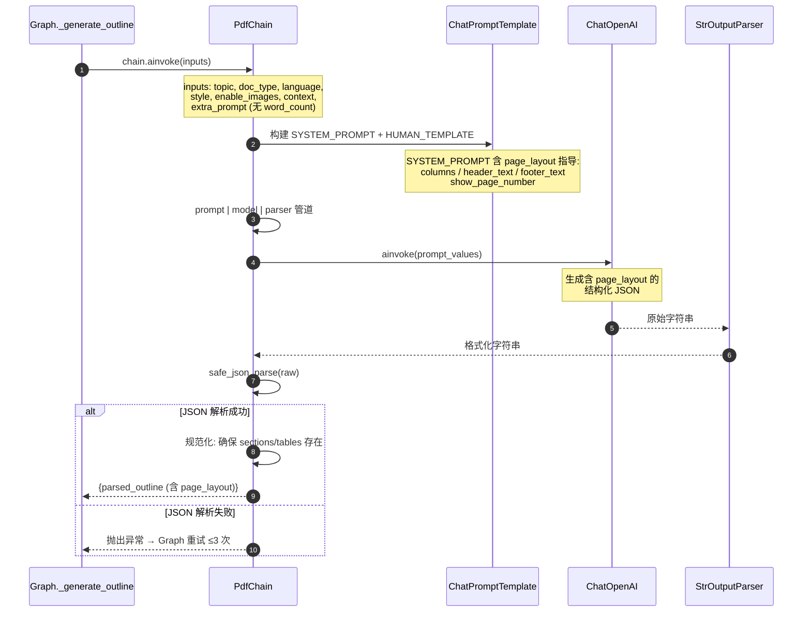
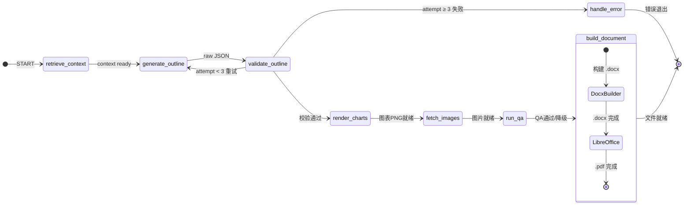
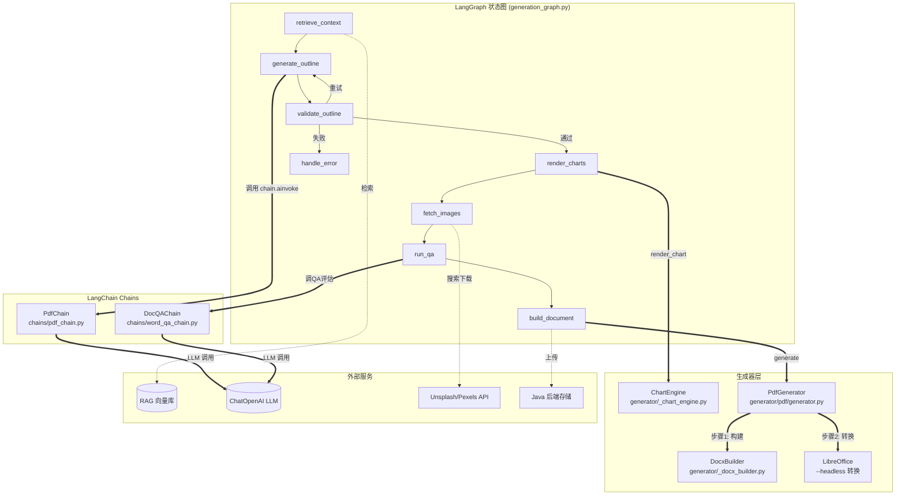

# PDF 文档生成设计

> v2.0 | 2026-05-22 | Phase 3 增强版（图表嵌入 + 图片 + QA）

---

## 一、概述

PDF 生成采用与 Word 完全相同的 DocxBuilder 渲染逻辑，额外增加 LibreOffice 无头转换步骤。

与 PPT/Word 共享 LangGraph 状态图架构和公共 ColorPalette 设计系统。

---

## 二、核心流程

```
POST /ai/pdf/generate
  → quota.consume（扣额度）
  → LangGraph 状态图:
      ├─ retrieve_context（RAG 检索，可选）
      ├─ generate_outline（PdfChain → LLM → JSON 解析）
      ├─ validate_outline（校验 title + sections ≥ 1）
      ├─ render_charts（matplotlib 渲染图表为 PNG）
      ├─ fetch_images（Unsplash → Pexels → 占位图）
      ├─ run_qa（DocQAChain 评分 + 修复循环）
      ├─ build_document:
      │     ├─ DocxBuilder 构建 .docx
      │     └─ LibreOffice --headless 转换 → .pdf
      └─ handle_error（失败重试 ≤3 次）
  → file.upload（上传 Java 后端）
  → 失败时 quota.refund（退额度）
```

---

## 三、Chain 设计 (`chains/pdf_chain.py`)

**PdfChain** — 增强 Prompt，与 Word 共享相同的 chart/image/table 描述结构。

**支持的文档类型：**

| doc_type | 说明 | 结构特点 |
|----------|------|----------|
| `report` | 报告 | title + sections（含 charts/images/tables） |
| `resume` | 简历 | 个人信息 + 教育经历 + 工作经历 + 技能 |
| `form` | 表单 | title + 表格为核心 |

**LLM 输出 JSON 额外支持 page_layout 配置：**

```json
{
  "page_layout": {
    "columns": 1,
    "header_text": "公司名称 — 年度报告",
    "footer_text": "第 {page} 页",
    "show_page_number": true
  }
}
```

图表、图片、表格的描述结构详见 `WORD_GENERATION.md` 第三章。

### 3.1 PdfChain 调用链



### 3.2 DocQAChain 调用链

PDF 与 Word 共用 `chains/word_qa_chain.py` 的 `DocQAChain`，评估及修复流程完全一致，详见 `WORD_GENERATION.md` 第 3.2 节。

---

## 四、生成器设计

### 4.1 公共 DocxBuilder (`generator/_docx_builder.py`)

Word 和 PDF 共用的文档构建器，详细功能见 `WORD_GENERATION.md` 第四章。

### 4.2 PdfGenerator (`generator/pdf/generator.py`)

两步生成策略：
1. **DocxBuilder 构建 .docx**（与 Word 完全相同）
2. **LibreOffice 无头转换 .docx → .pdf**

```bash
libreoffice --headless --convert-to pdf --outdir <dir> <file.docx>
```

- 超时：120 秒
- 失败回退：LibreOffice 不可用时抛出 `FileGenerationError`

### 4.3 图表引擎 (`generator/_chart_engine.py`)

与 Word 共用同一引擎。5 种图表类型（bar/line/pie/horizontal_bar/radar）渲染为 150 DPI PNG，嵌入到 docx 后随 LibreOffice 转换保留。

### 4.4 公共设计模块 (`generator/_design.py`)

6 套 ColorPalette，详情见 `WORD_GENERATION.md` 第四章。

---

## 五、状态图集成

`graph/generation_graph.py` 通过 `state["doc_type"] == "pdf"` 分发。

### 5.1 PDF 状态流转图

PDF 与 Word 共用同一套 Graph 节点路径，区别在于 `build_document` 节点额外执行 LibreOffice 转换。



### 5.2 Chain-Graph-Generator 关联图



**关联说明：**

| 图节点 | 调用的模块 | 数据流向 |
|--------|-----------|---------|
| `generate_outline` | `PdfChain.chain.ainvoke()` | topic → LLM → raw JSON（含 page_layout） |
| `render_charts` | `ChartEngine.render_chart()` | chart_spec → matplotlib → PNG 文件 |
| `fetch_images` | Unsplash / Pexels API | image_query → 搜索 → 下载 → 本地路径 |
| `run_qa` | `DocQAChain.evaluate_with_repair()` | outline → LLM 评估 → 修复后大纲 |
| `build_document` | `PdfGenerator.generate()` | outline → DocxBuilder(.docx) → LibreOffice(.pdf) |

---

## 六、API 接口

| 方法 | 路径 | 说明 |
|------|------|------|
| POST | `/ai/pdf/generate` | 同步生成 PDF 文档 |

请求体 (`PdfGenerateRequest`)：

| 字段 | 类型 | 必填 | 默认值 | 说明 |
|------|------|------|--------|------|
| doc_type | str | 否 | report | report / resume / form |
| style | str | 否 | academic | academic / business / creative / minimal / tech / warm |
| enable_images | bool | 否 | true | 是否自动搜索配图 |

---

## 七、环境依赖

PDF 生成需要系统安装 LibreOffice：

```bash
# Ubuntu/Debian
apt-get install libreoffice-writer

# Docker
RUN apt-get update && apt-get install -y libreoffice-writer
```

matplotlib 图表生成可选依赖（不安装也能生成纯文本文档）。

若 LibreOffice 未安装，PdfGenerator 会抛出 `FileGenerationError`。
