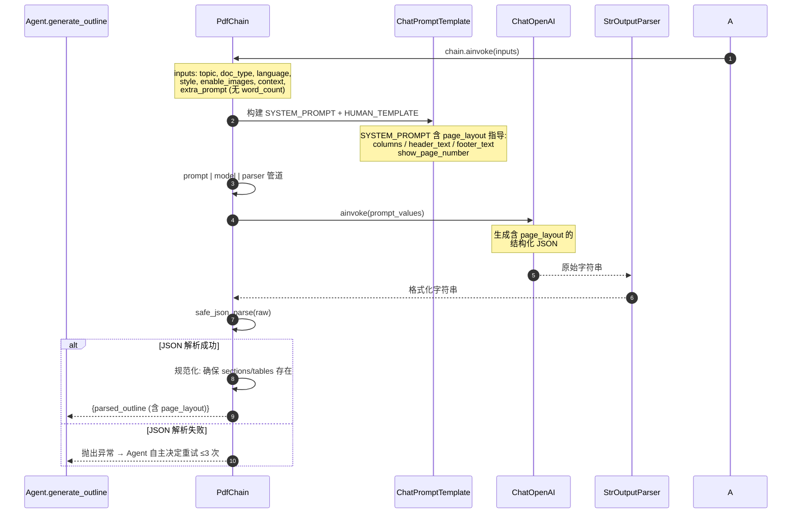
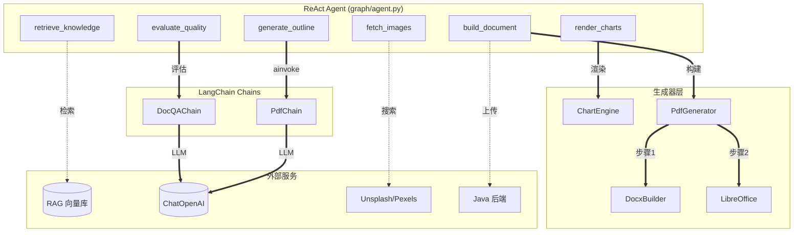

# PDF 文档生成设计

> v3.0 | 2026-05-30 | Agent 架构重构：从固定 StateGraph 升级为 ReAct Agent 自主编排

---

## 一、概述

PDF 生成采用 Agent 自主编排模式：LLM 驱动的 ReAct Agent 拥有 6 个工具，自主决定调用顺序与重试策略。生成逻辑与 Word 共享 DocxBuilder，额外增加 LibreOffice 无头转换步骤。

与 PPT/Word 共享同一套 Agent 编排架构和公共 ColorPalette 设计系统。

---

## 二、核心流程

```
Java 后端 → RabbitMQ (doc.generate.pdf)
  → broker/consumer.py 消费
  → graph/agent.py ReAct Agent 自主编排:
      ├─ [工具] retrieve_knowledge → RAG 检索（可选）
      ├─ [工具] generate_outline   → PdfChain → LLM → JSON
      ├─ [工具] render_charts      → matplotlib 渲染图表为 PNG
      ├─ [工具] fetch_images       → Unsplash → Pexels → 占位图
      ├─ [工具] evaluate_quality   → DocQAChain 评分 + 修复
      └─ [工具] build_document     → DocxBuilder → LibreOffice → .pdf
  → file.upload（上传 Java 后端）
  → HTTP 回调通知 Java 端

Agent 自主权：可跳过不需要的步骤；质量不达标时可反复重试；
始终以 build_document 作为最后一步。
```

---

## 三、Chain 设计 (`chains/pdf_chain.py`)

**PdfChain** — 增强 Prompt，与 Word 共享相同的 chart/image/table 描述结构。

**支持的文档类型：**

| doc_type | 说明 | 结构特点 |
|----------|------|----------|
| `report` | 报告 | title + sections（含 charts/images/tables） |
| `resume` | 简历 | 个人信息 + 教育经历 + 工作经历 + 技能 |
| `form` | 表单 | title + 表格为核心 |

**LLM 输出 JSON 额外支持 page_layout 配置：**

```json
{
  "page_layout": {
    "columns": 1,
    "header_text": "公司名称 — 年度报告",
    "footer_text": "第 {page} 页",
    "show_page_number": true
  }
}
```

图表、图片、表格的描述结构详见 `WORD_GENERATION.md` 第三章。

### 3.1 PdfChain 调用链



### 3.2 DocQAChain 调用链

PDF 与 Word 共用 `chains/word_qa_chain.py` 的 `DocQAChain`，评估及修复流程完全一致，详见 `WORD_GENERATION.md` 第 3.2 节。

---

## 四、生成器设计

### 4.1 公共 DocxBuilder (`generator/_docx_builder.py`)

Word 和 PDF 共用的文档构建器，详细功能见 `WORD_GENERATION.md` 第四章。

### 4.2 PdfGenerator (`generator/pdf/generator.py`)

两步生成策略：
1. **DocxBuilder 构建 .docx**（与 Word 完全相同）
2. **LibreOffice 无头转换 .docx → .pdf**

```bash
libreoffice --headless --convert-to pdf --outdir <dir> <file.docx>
```

- 超时：120 秒
- 失败回退：LibreOffice 不可用时抛出 `FileGenerationError`

### 4.3 图表引擎 (`generator/_chart_engine.py`)

与 Word 共用同一引擎。5 种图表类型（bar/line/pie/horizontal_bar/radar）渲染为 150 DPI PNG，嵌入到 docx 后随 LibreOffice 转换保留。

### 4.4 公共设计模块 (`generator/_design.py`)

6 套 ColorPalette，详情见 `WORD_GENERATION.md` 第四章。

---

## 五、Agent 编排

v3.0 起，PDF 生成由 `graph/agent.py` 中的 ReAct Agent 自主编排，流程与 Word 一致，区别仅在于 `build_document` 工具额外执行 LibreOffice 转换步骤。

### 5.1 PDF 构建流程

Agent 的 `build_document` 工具内部执行两步：

```
build_document 工具:
  1. DocxBuilder 构建 .docx（与 Word 完全相同）
  2. LibreOffice --headless 转换 .docx → .pdf
```

### 5.2 Agent-Generator 关联



---

## 六、API 接口

> **注意：** HTTP 同步接口（`POST /ai/pdf/generate`）已废弃。生产环境通过 RabbitMQ 异步消息队列触发生成，Java 后端发送消息到 `doc.generate.pdf` 路由键。

---

## 七、环境依赖

PDF 生成需要系统安装 LibreOffice：

```bash
# Ubuntu/Debian
apt-get install libreoffice-writer

# Docker
RUN apt-get update && apt-get install -y libreoffice-writer
```

matplotlib 图表生成可选依赖（不安装也能生成纯文本文档）。

若 LibreOffice 未安装，PdfGenerator 会抛出 `FileGenerationError`。
