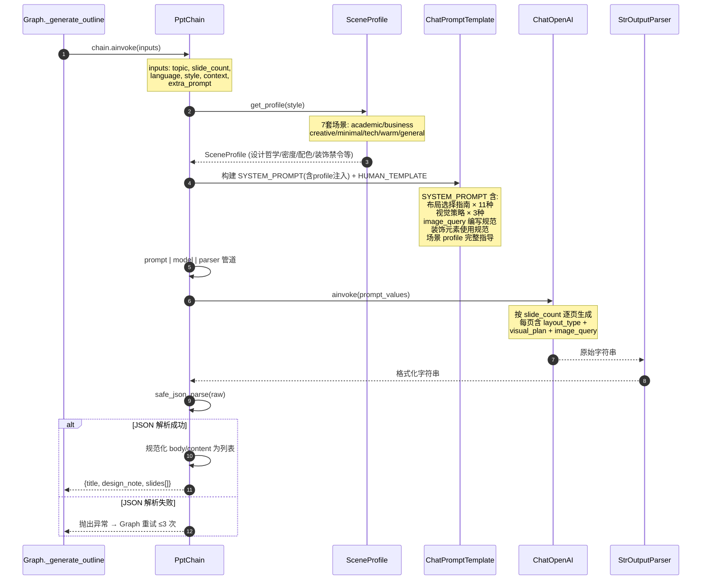
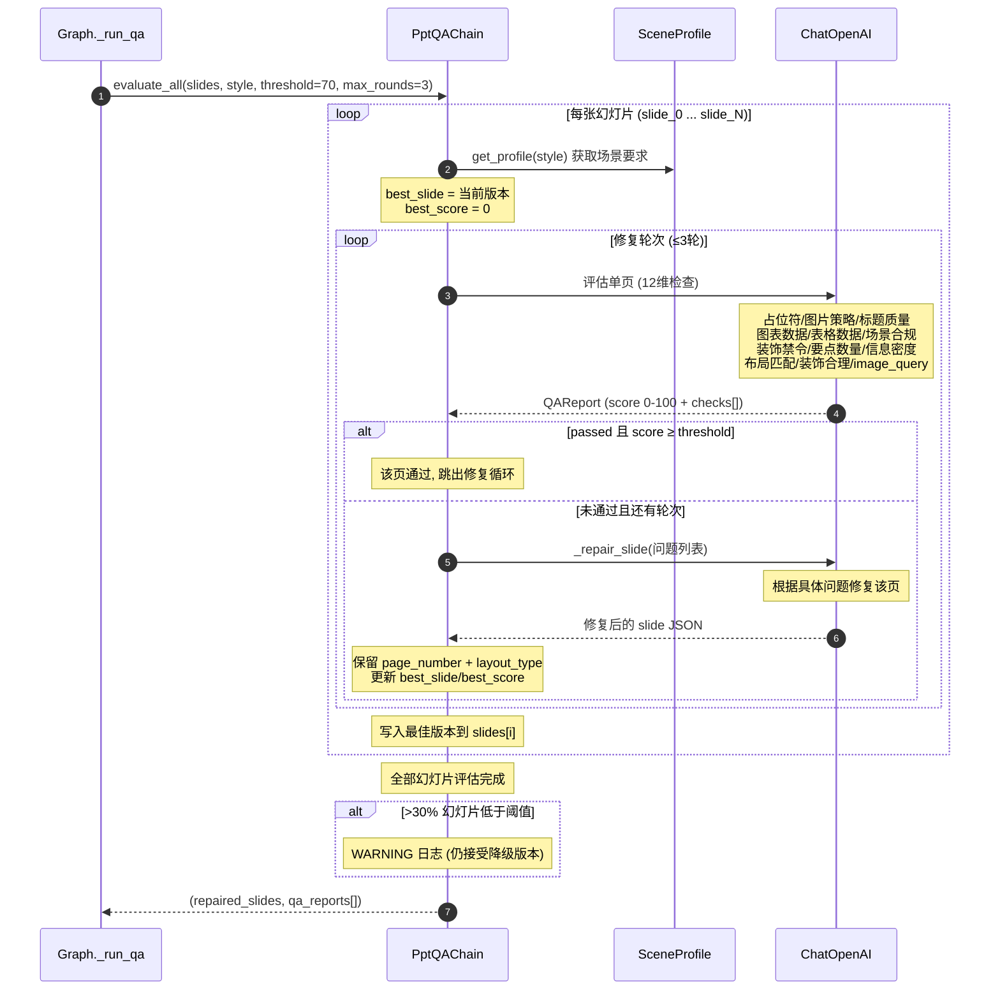
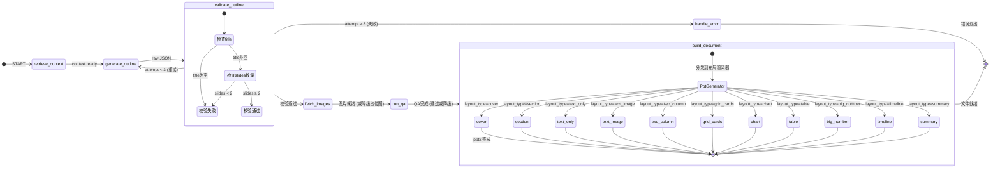
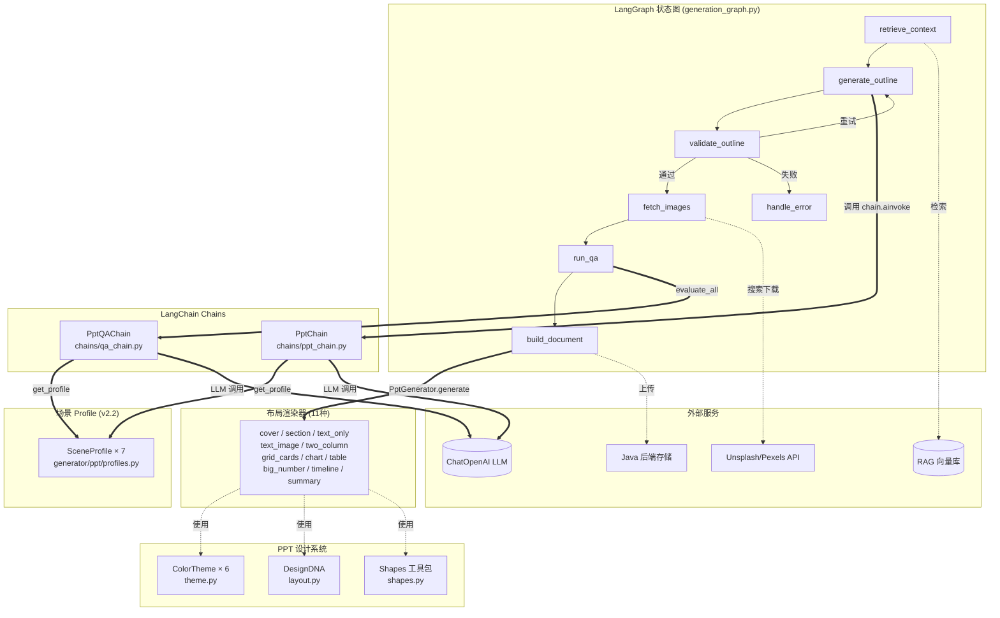

# PPT 生成功能设计文档

> v2.2 | 2026-05-26 | Phase 3 增强版（设计系统 + 14 种布局 + 图片 + QA + 场景 profiles + 图表/表格）

---

## 一、整体架构

```
POST /ai/ppt/generate (PptGenerateRequest)
  │
  ▼
api/ppt.py              ← FastAPI 路由，参数由 Pydantic 校验
  │
  ▼
services/generation.py  ← 业务编排：扣额度 → 调图 → 上传 / 退款
  │
  ▼
graph/generation_graph.py ← LangGraph 状态图：RAG → Chain → 校验 → 重试 (≤3)
  │                           PPT 额外: → 图片获取 → Q&A评分 → 修复循环
  │
  ├─ chains/ppt_chain.py    ← PptChain（视觉描述生成）
  ├─ chains/qa_chain.py     ← 质量评估 + 修复循环
  │
  ▼
generator/ppt/generator.py ← PptGenerator（分发到各布局渲染器）
  │
  ├─ generator/_design.py          ← 公共 ColorPalette（PPT/Word/PDF 共用，含 chart/table 色）
├─ generator/ppt/theme.py      ← PPT ColorTheme（从 _design 派生，含图表/表格衍生色）
  ├─ generator/ppt/layout.py     ← 14 种布局类型 + DesignDNA（含 info_density）
  ├─ generator/ppt/profiles.py   ← 7 套场景设计配置（设计哲学/密度/配色/叙事/装饰禁令）
  ├─ generator/ppt/shapes.py     ← 声明式绘图工具包（含富文本/菱形/箭头/星形）
  ├─ generator/ppt/layouts/      ← 每种布局的渲染器（11 种已实现）
  │   ├─ cover.py                (封面，3 种变体)
  │   ├─ section_header.py       (章节分隔，3 种变体)
  │   ├─ text_only.py            (纯文字 + 装饰)
  │   ├─ text_image.py           (图文混排：左右/上下)
  │   ├─ two_column.py           (双栏对比)
  │   ├─ grid_cards.py           (卡片网格)
  │   ├─ chart.py                (图表：柱/折/饼/面积图)  ← v2.2 新增
  │   ├─ table.py                (结构化数据表格)        ← v2.2 新增
  │   ├─ big_number.py           (核心指标大数字突出)    ← v2.2 新增
  │   ├─ timeline.py             (时间线/里程碑)         ← v2.2 新增
  │   └─ summary.py              (总结/致谢)
  └─ generator/ppt/image_provider.py ← 图片搜索/下载/降级  │
  ▼
client/file.py           ← RSA-SHA256 签名上传到 Java 后端存储
```

分层职责：

| 层 | 文件 | 职责 |
|----|------|------|
| API | `api/ppt.py` | HTTP 端点，接收 `PptGenerateRequest`，返回 `ApiResponse` |
| 服务 | `services/generation.py` | 业务编排：额度 `consume` / `refund`、图调用、文件上传 |
| 图 | `graph/generation_graph.py` | LangGraph 状态图，编排 RAG → Chain → 校验 → 图片 → QA → 构建 |
| Chain | `chains/ppt_chain.py` | PptChain，Prompt + LLM + JSON 视觉描述 |
| Chain | `chains/ppt_chain.py` | PptChain，Prompt（场景 profile 注入）+ LLM + JSON 视觉描述 |
| Chain | `chains/qa_chain.py` | 质量评估，逐页打分（含场景合规/图表数据检查）+ 修复循环 |
| 设计系统 | `generator/ppt/profiles.py` | 7 套场景设计配置（v2.2 新增） |
| 设计系统 | `generator/ppt/theme.py` | 6 套 ColorTheme |
| 设计系统 | `generator/ppt/layout.py` | 14 种 LayoutType + DesignDNA（含 info_density） |
| 设计系统 | `generator/ppt/shapes.py` | 声明式形状/文本框/图片/背景操作 |
| 渲染器 | `generator/ppt/layouts/*.py` | 每种布局类型的独立渲染实现 |
| 图片 | `generator/ppt/image_provider.py` | Unsplash→Pexels→占位图 三级降级 |
| 生成器 | `generator/ppt/generator.py` | PptGenerator，分发到各布局渲染器 |

---

## 二、生成模式

LLM 输出含 `layout_type` / `visual_plan` / `image_query` / `decorations` 的丰富 JSON，
Generator 通过设计系统 + 布局渲染器生成视觉丰富的幻灯片。

**核心能力**:
- 11 种布局渲染器（cover / section / text_only / text_image / two_column / grid_cards / chart / table / big_number / timeline / summary）
- 每页可指定装饰元素（强调条、圆形装饰、分割线）
- 自动图片搜索与插入（Unsplash/Pexels）
- 逐页质量评分 + 修复循环（最多 3 轮）
- 6 套预设颜色主题

---

## 三、LangChain Chain 设计

### 3.1 `chains/ppt_chain.py` — PptChain

**Prompt 特点**:
- 布局类型选择指南（11 种类型，何时用哪种）
- 视觉策略说明（MEDIA_REQUIRED / BASIC_GRAPHICS_ONLY / AUTO）
- image_query 编写规范（英文关键词 3-6 词）
- 装饰元素使用规范（accent_bar / circle / line 等）
- 风格适配指导（6 种风格各不同视觉语言）
- 反占位符约束

**输出 JSON Schema**:
```json
{
  "title": "演示文稿主标题",
  "design_note": "整体设计方向的一句话概括",
  "slides": [
    {
      "page_number": 1,
      "layout_type": "cover",
      "title": "标题",
      "subtitle": "副标题",
      "body": ["附加信息"],
      "visual_plan": {
        "strategy": "MEDIA_REQUIRED",
        "bg_treatment": "gradient",
        "decorations": [
          {"type": "accent_bar", "position": "left", "color": "accent"},
          {"type": "circle", "position": "bottom_right", "size": "large"}
        ]
      },
      "image_query": "search keywords in English",
      "image_position": "right",
      "notes": "演讲备注"
    }
  ]
}
```

### 3.2 `chains/qa_chain.py` — PptQAChain

**QA 检查维度**（v2.2 扩展至 12 维，新增图表数据/场景合规/装饰禁令）:

| 维度 | 检查内容 | 严重级别 |
|------|---------|---------|
| 占位符 | 是否有 "[图片]"、"TODO" 等占位文字 | 阻塞 |
| 图片策略 | MEDIA_REQUIRED 时 image_query 是否非空 | 阻塞 |
| 标题质量 | 是否简洁有力（非空泛表述） | 高风险 |
| 图表数据 | layout_type=chart 时 chart_data 是否完整 | 高风险 (v2.2) |
| 表格数据 | layout_type=table 时 table_data 是否完整 | 高风险 (v2.2) |
| 场景合规 | 设计是否符合场景 profile 的要求 | 高风险 (v2.2) |
| 装饰禁令 | 是否违反场景 style 的装饰禁令 | 高风险 (v2.2) |
| 要点数量 | body/content 是否在 2-6 条 | 警告 |
| 信息密度 | 每条是否传达具体信息 | 警告 |
| 布局匹配 | layout_type 与内容是否匹配 | 警告 |
| 装饰合理 | decorations 数量是否合理 | 警告 |
| image_query | 是否可搜索的英文关键词 | 高风险 |

**修复循环**:
```
每页评估 → score ≥ 70 → 通过
          → score < 70 → LLM 修复（带具体问题列表）→ 重新评估（最多 3 轮）
```

### 3.3 PptChain 调用链



### 3.4 PptQAChain 调用链 (逐页评估 + 修复循环)



---

## 三之B、场景设计配置文件 (v2.2 新增)

`generator/ppt/profiles.py` 定义 7 套场景设计配置（SceneProfile），
源自 wtfppt 的设计知识系统化整理：

| profile | 风格 | 信息密度 | 叙事风格 | 推荐布局 |
|---------|------|---------|---------|---------|
| academic | 学术答辩 | high (70-85%) | 论证驱动 | cover/section/text_only/text_image/chart/table/summary |
| business | 商业洞察 | extreme (90%+) | 洞察驱动 | cover/section/text_only/chart/table/big_number/two_column |
| creative | 创意视觉 | sparse (40-60%) | 情感共鸣 | cover/text_image/image_full/big_number/quote |
| minimal | 极简 | sparse (50-65%) | 金句型 | cover/big_number/quote/text_image/summary |
| tech | 科技 | balanced (50-70%) | 方案驱动 | cover/section/text_image/chart/big_number/timeline |
| warm | 温暖 | balanced (50-65%) | 故事叙述 | cover/section/text_only/text_image/grid_cards/timeline |
| general | 通用 | balanced (55-70%) | 标准商务 | cover/section/text_only/text_image/chart/table/summary |

每套 profile 含 10 个维度：设计哲学、信息密度、图文比例、配色指引、
字体层级、内容页结构、叙事风格、内容表达技巧、装饰禁令、推荐布局。

PptChain 的 SYSTEM_PROMPT 根据 style 参数动态注入对应 profile 的完整指导。
QA 链也根据 profile 进行场景合规性检查。


## 四、设计系统

### 4.0 公共设计系统 (`generator/_design.py`) — v2.2 扩展

ColorPalette 新增图表/表格专用语义色：

| 新增字段 | 说明 | 示例值 |
|---------|------|--------|
| chart_colors | 图表数据系列颜色序列（6色） | ["#1A3C6E", "#556B8D", ...] |
| table_header_fill | 表格表头填充色（默认取 primary） | "#1A3C6E" |
| table_alt_fill | 表格交替行底色 | "#F5F7FA" |
| table_border | 表格边框色 | "#D5DCE5" |

各主题预配了风格匹配的图表色板（academic 学术期刊风 / business 咨询报告风 等）。

### 4.1 颜色主题 (`generator/ppt/theme.py`)

6 套 ColorTheme，每套包含 8 种语义色 + 2 种字体:

| 主题 | 调性 | 主色 |
|------|------|------|
| academic | 严谨正式 | 深蓝 #1A3C6E |
| business | 专业简洁 | 深蓝 #1B3A5C |
| creative | 活泼视觉 | 暖红 #E04A36 |
| minimal | 极简留白 | 深灰 #2D2D2D |
| tech | 科技感 | 蓝色 #0D47A1 |
| warm | 温暖柔和 | 棕色 #8B451E |

### 4.2 设计 DNA (`generator/ppt/layout.py`)

基于 `topic + style` 的 SHA256 哈希做确定性选择，字段:

| 字段 | 可选值 | 影响 |
|------|--------|------|
| shape_style | sharp / rounded / pill | 矩形圆角风格 |
| density | sparse / balanced / dense | 字号和间距 |
| decoration_level | minimal / moderate / rich | 装饰元素密度 |
| cover_variant | 0 / 1 / 2 | 封面布局变体 |
| section_variant | 0 / 1 / 2 | 章节页变体 |

### 4.3 形状工具包 (`generator/ppt/shapes.py`) — v2.2 扩展

封装常用 python-pptx 操作:
- `add_rect()` / `add_circle()` / `add_accent_bar()` / `add_line()` — 基本形状
- `add_diamond()` / `add_arrow_shape()` / `add_star()` / `add_pill_shape()` — 增强形状 (v2.2)
- `add_text_box()` / `add_multiline_text_box()` / `add_rich_text_box()` — 文字 (v2.2: 富文本)
- `add_image()` — 图片（自动等比缩放居中裁剪）
- `set_slide_bg()` / `add_page_number()` / `clear_placeholders()` — 页面

富文本支持轻量标记: `**粗体**` / `*斜体*` / `[文本](url)`

### 4.4 布局渲染器 (`generator/ppt/layouts/`)

| 渲染器 | 布局类型 | 变体数 | 说明 |
|--------|---------|--------|------|
| cover.py | cover | 3 | 渐变+强调条 / 色块分区 / 居中极简 |
| section_header.py | section | 3 | 左侧强调条 / 深色全幅 / 编号式 |
| text_only.py | text_only | 1 | 标题+要点+装饰 |
| text_image.py | text_image | 2 | 左右图文 / 上图下文 |
| two_column.py | two_column | 1 | 双栏对比（含标签头） |
| grid_cards.py | grid_cards | 1 | 3-4卡片网格 |
| chart.py | chart | 1 | 柱/折/饼/面积图，自动应用主题色 |  ← v2.2 新增
| table.py | table | 1 | 结构化数据表格，表头深底白字+交替行 |  ← v2.2 新增
| big_number.py | big_number | 1 | 1-4个核心指标大数字突出 |  ← v2.2 新增
| timeline.py | timeline | 1 | 水平时间线/里程碑（≤6节点） |  ← v2.2 新增
| summary.py | summary | 1 | 居中致谢+装饰 |

---

## 五、图片集成

### 5.1 来源与降级

```
1. Unsplash API → 搜索 → 下载（优先）
2. Pexels API  → 搜索 → 下载（备选）
3. 纯色占位图（PIL 生成带文字标签的 PNG）→ 最终降级
```

### 5.2 流程

```
1. 解析 LLM 输出 → 收集 image_query (strategy=MEDIA_REQUIRED 的页面)
2. 并发搜索下载（最多 4 路，含缓存避免重复）
3. 图片路径回传到 Generator
4. 布局渲染器调用 add_image() 插入
5. 无图时绘制带提示文字的占位色块
```

---

## 六、LangGraph 状态图设计

### 6.1 状态 (`GenerationState`)

PPT 特有字段:
- `enable_images: bool` — 是否启用图片搜索
- `images_map: dict` — slide_key → 本地图片路径列表
- `qa_reports: list[dict]` — 逐页 QA 评分结果

### 6.2 节点

| 节点 | 适用文档 | 职责 |
|------|---------|------|
| `retrieve_context` | 全部 | RAG 检索 |
| `generate_outline` | 全部 | Chain 调用（PPT 用 PptChain） |
| `validate_outline` | 全部 | 校验 JSON 结构 |
| `fetch_images` | PPT | 图片搜索与下载 |
| `run_qa` | PPT | 逐页 Q&A + 修复循环 |
| `build_document` | 全部 | Generator 构建文件 |
| `handle_error` | 全部 | 错误记录 |

### 6.3 路由

```
PPT: START → retrieve → generate → validate → fetch_images → run_qa → build → END
Word/PDF: START → retrieve → generate → validate → render_charts → fetch_images → run_qa → build → END
```

### 6.4 PPT 状态流转图



### 6.5 Chain-Graph-Generator 关联图



**关联说明：**

| 图节点 | 调用的模块 | 数据流向 |
|--------|-----------|---------|
| `retrieve_context` | RAG 向量库 | material_ids → 检索 → 格式化上下文 |
| `generate_outline` | `PptChain.chain.ainvoke()` | topic + style → SceneProfile 注入 → LLM → slides JSON |
| `validate_outline` | 内联校验逻辑 | 检查 title 非空 + slides ≥ 2 |
| `fetch_images` | Unsplash → Pexels → 占位图 | image_query → 三级降级搜索 → 本地路径 |
| `run_qa` | `PptQAChain.evaluate_all()` | slides → 逐页12维评估 → 修复循环 → repaired_slides |
| `build_document` | `PptGenerator.generate()` | slides + images_map → 11种布局分发 → .pptx |

**PPT 与 Word/PDF 的关键差异：**

| 差异点 | PPT | Word/PDF |
|--------|-----|----------|
| Chain | PptChain (场景 profile 注入) | WordChain / PdfChain |
| QA | PptQAChain (逐页12维评估) | DocQAChain (整体8维评估) |
| render_charts | 无 (图表在生成时内嵌) | 有 (预渲染为 PNG) |
| 图片策略 | 按 slide 的 image_query 搜索 | 按 section 的 images[] 搜索 |
| 输出格式 | python-pptx 直接构建 .pptx | DocxBuilder → .docx (→ LibreOffice .pdf) |

## 七、API 接口

### 7.1 端点

```
POST /ai/ppt/generate
Content-Type: application/json
X-Timestamp / X-Nonce / X-Signature (RSA-SHA256)
```

**请求体** (`PptGenerateRequest` 继承 `GenerateRequest`)：

| 字段 | 类型 | 必填 | 默认值 | 说明 |
|------|------|------|--------|------|
| `user_id` | str | 是 | — | 用户 ID |
| `project_id` | str | 是 | — | 项目 ID |
| `topic` | str | 是 | — | 文档主题 |
| `language` | str | 否 | zh | zh / en |
| `extra_prompt` | str | 否 | — | 用户补充指令 |
| `material_ids` | list[str] | 否 | — | RAG 素材 ID 列表 |
| `rag_enabled` | bool | 否 | false | 是否启用 RAG |
| `callback_id` | str | 是 | — | 关联 Java 后端请求 ID |
| `style` | str | 否 | academic | academic/business/creative/minimal/tech/warm |
| `slide_count` | int | 否 | 10 | 1–50 |
| `enable_images` | bool | 否 | true | 是否自动搜索配图（Unsplash→Pexels→占位图降级） |

**响应** (`ApiResponse`)：

```json
{
  "code": 0,
  "message": "success",
  "data": { "file_id": "...", "file_url": "..." }
}
```

---

## 八、配置项

`config.py` 新增:

| 配置项 | 默认值 | 说明 |
|------|--------|------|
| ppt_qa_enabled | True | 是否启用 Q&A |
| ppt_qa_score_threshold | 70 | Q&A 通过阈值 |
| ppt_max_repair_rounds | 3 | 单页最大修复轮数 |
| ppt_image_enabled | True | 是否启用图片搜索 |
| ppt_image_source | unsplash | unsplash / pexels |
| ppt_unsplash_access_key | "" | Unsplash API Key |
| ppt_pexels_api_key | "" | Pexels API Key |
| ppt_max_concurrent_slides | 4 | 并发图片下载数 |

---

## 九、文件清单

| 文件 | 操作 | 说明 |
|------|------|------|
| `generator/_design.py` | **修改** | ColorPalette 新增 chart/table 语义色 |
| `generator/ppt/theme.py` | **新建/修改** | 6 套 ColorTheme，透传图表/表格色到 RGBColor |
| `generator/ppt/profiles.py` | **新建 (v2.2)** | 7 套场景设计配置 SceneProfile |
| `generator/ppt/shapes.py` | **新建/修改** | 声明式绘图工具包 + 富文本 + 增强形状 |
| `generator/ppt/layouts/chart.py` | **新建 (v2.2)** | 图表布局渲染器（柱/折/饼/面积图） |
| `generator/ppt/layouts/table.py` | **新建 (v2.2)** | 表格布局渲染器 |
| `generator/ppt/layouts/big_number.py` | **新建 (v2.2)** | 大数字展示布局渲染器 |
| `generator/ppt/layouts/timeline.py` | **新建 (v2.2)** | 时间线布局渲染器 |
| `generator/ppt/layout.py` | **新建/修改** | 14 种 LayoutType + DesignDNA（含 info_density） |
| `generator/ppt/layouts/` | **增强** | 11 种布局渲染器（原 7 种 + 新增 4 种） |
| `generator/ppt/image_provider.py` | **新建** | 图片搜索/下载/降级 |
| `generator/ppt/generator.py` | **重构** | PptGenerator（设计系统 + 布局分发） |
| `chains/ppt_chain.py` | **重构 (v2.2)** | 场景 profile 注入式视觉描述 Prompt |
| `chains/qa_chain.py` | **增强 (v2.2)** | QA 扩展至 12 维（含场景合规/图表数据检查） |
| `graph/generation_graph.py` | **重构** | 新增 fetch_images / run_qa 节点 |
| `config.py` | **修改** | 新增 PPT 相关配置项 |
| `core/schemas.py` | **修改** | PptGenerateRequest 新增 enable_images |
| `services/generation.py` | **修改** | 传递新参数到 Graph |
| `tests/test_ppt_complex.py` | **新建** | 完整测试套件 (7 项) |
