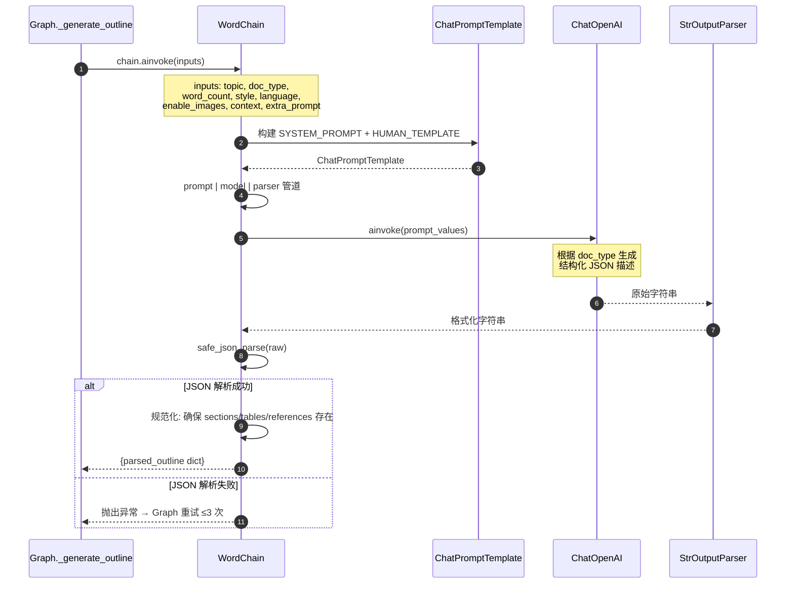
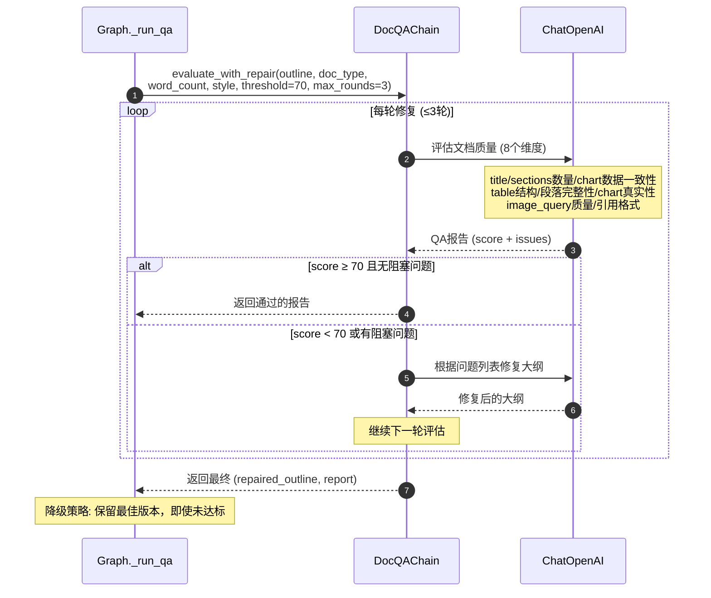
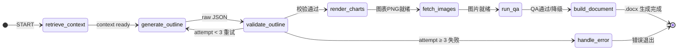
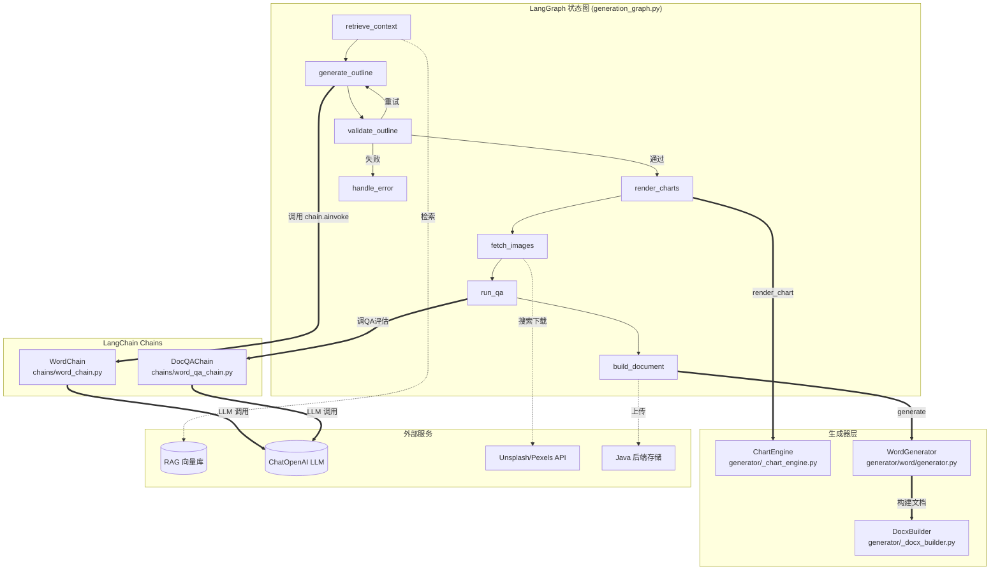

# Word 文档生成设计

> v2.0 | 2026-05-22 | Phase 3 增强版（图表嵌入 + 图片 + QA）

---

## 一、概述

Word 生成采用增强型流程：LLM 生成含图表/插图/表格描述的结构化 JSON → DocxBuilder 渲染为 .docx。

与 PPT/PDF 共享同一套 LangGraph 状态图架构和公共 ColorPalette 设计系统。

---

## 二、核心流程

```
POST /ai/word/generate
  → quota.consume（扣额度）
  → LangGraph 状态图:
      ├─ retrieve_context（RAG 检索，可选）
      ├─ generate_outline（WordChain → LLM → JSON 解析）
      ├─ validate_outline（校验 title + sections ≥ 1）
      ├─ render_charts（matplotlib 渲染图表为 PNG）
      ├─ fetch_images（Unsplash → Pexels → 占位图）
      ├─ run_qa（DocQAChain 评分 + 修复循环 ≤2 轮）
      ├─ build_document（DocxBuilder → .docx）
      └─ handle_error（失败重试 ≤3 次）
  → file.upload（上传 Java 后端）
  → 失败时 quota.refund（退额度）
```

---

## 三、Chain 设计 (`chains/word_chain.py`)

**WordChain** — 增强 Prompt 支持图表 + 插图 + 表格。

**支持的文档类型：**

| doc_type | 说明 | 结构特点 |
|----------|------|----------|
| `essay` | 论文 | title + abstract + sections + references |
| `report` | 报告 | title + sections（含 charts/images/tables） + references |
| `letter` | 信函 | title + sections（通常无图表） |
| `paper` | 学术论文 | title + abstract + sections + references |

**LLM 输出 JSON 结构：**

```json
{
  "title": "文档主标题",
  "subtitle": "副标题（可选）",
  "abstract": "摘要（可选）",
  "sections": [
    {
      "heading": "章节标题",
      "content": ["段落1（≥50字）", "段落2"],
      "charts": [
        {
          "type": "bar",
          "title": "图表标题",
          "data": {
            "labels": ["A", "B", "C"],
            "datasets": [{"label": "系列1", "values": [10, 20, 15]}]
          },
          "width": "full",
          "caption": "图表说明（可选）"
        }
      ],
      "images": [
        {
          "query": "search keywords in English",
          "caption": "图片说明",
          "width": "half",
          "align": "center"
        }
      ]
    }
  ],
  "tables": [
    {
      "caption": "表格标题",
      "headers": ["列1", "列2"],
      "rows": [["值1", "值2"]],
      "width": "full"
    }
  ],
  "references": ["[1] 参考文献"]
}
```

**图表类型 (chart.type)**：

| 类型 | 说明 | 适用场景 |
|------|------|---------|
| `bar` | 柱状图 | 类别对比 |
| `line` | 折线图 | 趋势变化 |
| `pie` | 饼图 | 占比分布 |
| `horizontal_bar` | 横向柱状图 | 长标签排名 |
| `radar` | 雷达图 | 多维指标对比 |

### 3.1 WordChain 调用链



### 3.2 DocQAChain 调用链



---

## 四、生成器设计

### 4.1 公共 DocxBuilder (`generator/_docx_builder.py`)

Word 和 PDF 共用的增强型 python-docx 构建器，支持：

| 功能 | 方法 | 说明 |
|------|------|------|
| 封面 | `add_cover()` | 标题 + 副标题 + 元信息 + 分页 |
| 摘要 | `add_abstract()` | "摘要" 标题 + 段落 + 分页 |
| 章节 | `add_section()` | 标题 + 段落 + 内嵌图表 + 内嵌图片 |
| 表格 | `add_table()` | 表头背景色 + 斑马条纹 |
| 图表 | 章节内嵌 | matplotlib PNG → `add_picture()` |
| 图片 | 章节内嵌 | 本地路径 → `add_picture()` |
| 参考文献 | `add_references()` | [编号] 格式化列表 |

### 4.2 WordGenerator (`generator/word/generator.py`)

- 接收 LLM 输出的 JSON + images_map
- 将图片路径注入到 sections[].images[]._local_path
- 调用 DocxBuilder 构建 Document → 保存为 .docx

### 4.3 图表引擎 (`generator/_chart_engine.py`)

基于 matplotlib 的 5 种图表渲染器：
- 中文字体自动检测（WenQuanYi → SimHei → DejaVu fallback）
- 高 DPI 输出（150 DPI PNG）
- 自动应用 ColorPalette 配色
- matplotlib 不存在时静默跳过

### 4.4 公共设计模块 (`generator/_design.py`)

6 套 ColorPalette（hex 字符串存储），PPT/Word/PDF 共用：
- academic / business / creative / minimal / tech / warm
- PPT 通过 `generator/ppt/theme.py` 的 `ColorTheme.from_palette()` 转换为 pptx RGBColor
- Word/PDF 通过 `hex_to_rgb()` helper 转换为 docx RGBColor

### 4.5 DocQAChain (`chains/word_qa_chain.py`)

Word/PDF 文档质量评估，检查维度：

| 维度 | 检查内容 | 严重级别 |
|------|---------|---------|
| title 存在 | 文档主标题非空 | 阻塞 |
| sections 数量 | ≥ 1 个章节 | 阻塞 |
| chart 数据一致性 | labels 与 values 长度匹配 | 阻塞 |
| table 结构 | headers 与 rows 列数匹配 | 阻塞 |
| 段落完整性 | 每段 ≥ 50 字 | 高风险 |
| chart 数据真实性 | 数值合理 | 高风险 |
| image_query 质量 | 可搜索英文关键词 | 警告 |
| 引用格式 | [编号] 格式 | 警告 |

---

## 五、状态图集成

`graph/generation_graph.py` 通过 `state["doc_type"] == "word"` 分发。

### 5.1 Word/PDF 状态流转图



### 5.2 Chain-Graph-Generator 关联图



**关联说明：**

| 图节点 | 调用的模块 | 数据流向 |
|--------|-----------|---------|
| `generate_outline` | `WordChain.chain.ainvoke()` | topic → LLM → raw JSON → safe_json_parse |
| `render_charts` | `ChartEngine.render_chart()` | chart_spec → matplotlib → PNG 文件 |
| `fetch_images` | Unsplash / Pexels API | image_query → 搜索 → 下载 → 本地路径 |
| `run_qa` | `DocQAChain.evaluate_with_repair()` | outline → LLM 评估 → 修复后大纲 |
| `build_document` | `WordGenerator.generate()` | outline + images_map → DocxBuilder → .docx |

---

## 六、API 接口

| 方法 | 路径 | 说明 |
|------|------|------|
| POST | `/ai/word/generate` | 同步生成 Word 文档（30–90 秒） |

请求体 (`WordGenerateRequest`)：

| 字段 | 类型 | 必填 | 默认值 | 说明 |
|------|------|------|--------|------|
| doc_type | str | 否 | essay | essay / report / letter / paper |
| word_count | int | 否 | 2000 | 目标字数，500–10000 |
| style | str | 否 | academic | academic / business / creative / minimal / tech / warm |
| enable_images | bool | 否 | true | 是否自动搜索配图 |
