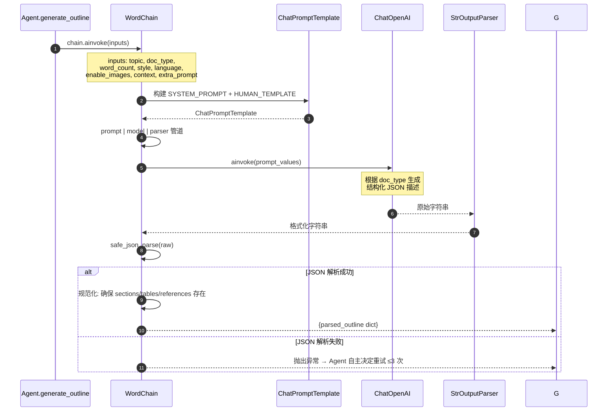
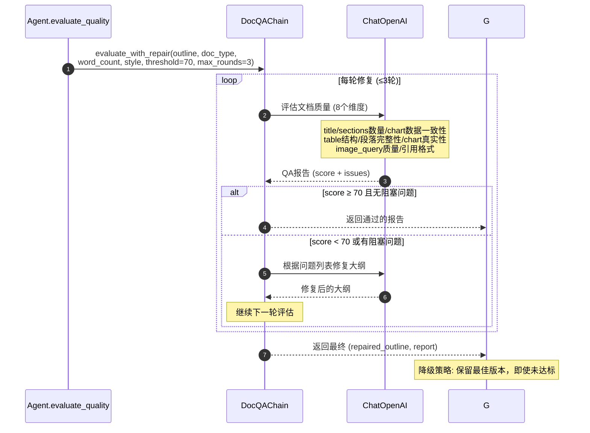
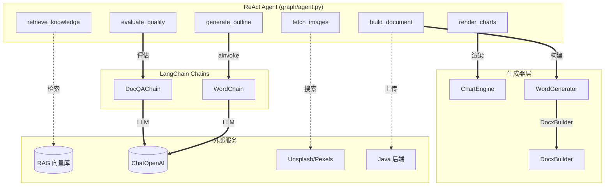

# Word 文档生成设计

> v3.0 | 2026-05-30 | Agent 架构重构：从固定 StateGraph 升级为 ReAct Agent 自主编排

---

## 一、概述

Word 生成采用 Agent 自主编排模式：LLM 驱动的 ReAct Agent 拥有 6 个工具，自主决定调用顺序与重试策略。LLM 生成含图表/插图/表格描述的结构化 JSON → DocxBuilder 渲染为 .docx。

与 PPT/PDF 共享同一套 Agent 编排架构和公共 ColorPalette 设计系统。

---

## 二、核心流程

```
Java 后端 → RabbitMQ (doc.generate.word)
  → broker/consumer.py 消费
  → graph/agent.py ReAct Agent 自主编排:
      ├─ [工具] retrieve_knowledge → RAG 检索（可选）
      ├─ [工具] generate_outline   → WordChain → LLM → JSON
      ├─ [工具] render_charts      → matplotlib 渲染图表为 PNG
      ├─ [工具] fetch_images       → Unsplash → Pexels → 占位图
      ├─ [工具] evaluate_quality   → DocQAChain 评分 + 修复
      └─ [工具] build_document     → DocxBuilder → .docx
  → file.upload（上传 Java 后端）
  → HTTP 回调通知 Java 端

Agent 自主权：可跳过不需要的步骤；质量不达标时可反复重试；
始终以 build_document 作为最后一步。
```

---

## 三、Chain 设计 (`chains/word_chain.py`)

**WordChain** — 增强 Prompt 支持图表 + 插图 + 表格。

**支持的文档类型：**

| doc_type | 说明 | 结构特点 |
|----------|------|----------|
| `essay` | 论文 | title + abstract + sections + references |
| `report` | 报告 | title + sections（含 charts/images/tables） + references |
| `letter` | 信函 | title + sections（通常无图表） |
| `paper` | 学术论文 | title + abstract + sections + references |

**LLM 输出 JSON 结构：**

```json
{
  "title": "文档主标题",
  "subtitle": "副标题（可选）",
  "abstract": "摘要（可选）",
  "sections": [
    {
      "heading": "章节标题",
      "content": ["段落1（≥50字）", "段落2"],
      "charts": [
        {
          "type": "bar",
          "title": "图表标题",
          "data": {
            "labels": ["A", "B", "C"],
            "datasets": [{"label": "系列1", "values": [10, 20, 15]}]
          },
          "width": "full",
          "caption": "图表说明（可选）"
        }
      ],
      "images": [
        {
          "query": "search keywords in English",
          "caption": "图片说明",
          "width": "half",
          "align": "center"
        }
      ]
    }
  ],
  "tables": [
    {
      "caption": "表格标题",
      "headers": ["列1", "列2"],
      "rows": [["值1", "值2"]],
      "width": "full"
    }
  ],
  "references": ["[1] 参考文献"]
}
```

**图表类型 (chart.type)**：

| 类型 | 说明 | 适用场景 |
|------|------|---------|
| `bar` | 柱状图 | 类别对比 |
| `line` | 折线图 | 趋势变化 |
| `pie` | 饼图 | 占比分布 |
| `horizontal_bar` | 横向柱状图 | 长标签排名 |
| `radar` | 雷达图 | 多维指标对比 |

### 3.1 WordChain 调用链



### 3.2 DocQAChain 调用链



---

## 四、生成器设计

### 4.1 公共 DocxBuilder (`generator/_docx_builder.py`)

Word 和 PDF 共用的增强型 python-docx 构建器，支持：

| 功能 | 方法 | 说明 |
|------|------|------|
| 封面 | `add_cover()` | 标题 + 副标题 + 元信息 + 分页 |
| 摘要 | `add_abstract()` | "摘要" 标题 + 段落 + 分页 |
| 章节 | `add_section()` | 标题 + 段落 + 内嵌图表 + 内嵌图片 |
| 表格 | `add_table()` | 表头背景色 + 斑马条纹 |
| 图表 | 章节内嵌 | matplotlib PNG → `add_picture()` |
| 图片 | 章节内嵌 | 本地路径 → `add_picture()` |
| 参考文献 | `add_references()` | [编号] 格式化列表 |

### 4.2 WordGenerator (`generator/word/generator.py`)

- 接收 LLM 输出的 JSON + images_map
- 将图片路径注入到 sections[].images[]._local_path
- 调用 DocxBuilder 构建 Document → 保存为 .docx

### 4.3 图表引擎 (`generator/_chart_engine.py`)

基于 matplotlib 的 5 种图表渲染器：
- 中文字体自动检测（WenQuanYi → SimHei → DejaVu fallback）
- 高 DPI 输出（150 DPI PNG）
- 自动应用 ColorPalette 配色
- matplotlib 不存在时静默跳过

### 4.4 公共设计模块 (`generator/_design.py`)

6 套 ColorPalette（hex 字符串存储），PPT/Word/PDF 共用：
- academic / business / creative / minimal / tech / warm
- PPT 通过 `generator/ppt/theme.py` 的 `ColorTheme.from_palette()` 转换为 pptx RGBColor
- Word/PDF 通过 `hex_to_rgb()` helper 转换为 docx RGBColor

### 4.5 DocQAChain (`chains/word_qa_chain.py`)

Word/PDF 文档质量评估，检查维度：

| 维度 | 检查内容 | 严重级别 |
|------|---------|---------|
| title 存在 | 文档主标题非空 | 阻塞 |
| sections 数量 | ≥ 1 个章节 | 阻塞 |
| chart 数据一致性 | labels 与 values 长度匹配 | 阻塞 |
| table 结构 | headers 与 rows 列数匹配 | 阻塞 |
| 段落完整性 | 每段 ≥ 50 字 | 高风险 |
| chart 数据真实性 | 数值合理 | 高风险 |
| image_query 质量 | 可搜索英文关键词 | 警告 |
| 引用格式 | [编号] 格式 | 警告 |

---

## 五、Agent 编排

v3.0 起，Word 生成由 `graph/agent.py` 中的 ReAct Agent 自主编排。

### 5.1 Agent 工具

| 工具 | 对应模块 | Word 中的职责 |
|------|---------|-------------|
| `retrieve_knowledge` | `rag/retrieval.py` | RAG 检索（可选） |
| `generate_outline` | `chains/word_chain.py` | WordChain 生成结构化大纲 |
| `render_charts` | `generator/_chart_engine.py` | matplotlib 渲染图表 PNG |
| `fetch_images` | `generator/ppt/image_provider.py` | Unsplash→Pexels→占位图 |
| `evaluate_quality` | `chains/word_qa_chain.py` | DocQAChain 评分 + 修复 |
| `build_document` | `generator/word/generator.py` | DocxBuilder → .docx |

### 5.2 Agent-Chain-Generator 关联



---

## 六、API 接口

> **注意：** HTTP 同步接口（`POST /ai/word/generate`）已废弃。生产环境通过 RabbitMQ 异步消息队列触发生成，Java 后端发送消息到 `doc.generate.word` 路由键。
